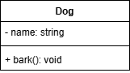
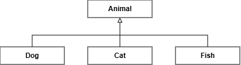
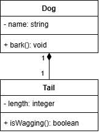
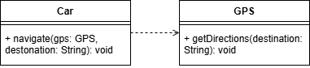

# Unified Modelling Language

UML is used to model our systems, visually showing the relationships between our classes.

https://app.diagrams.net/

## Representing a class

A `Dog` class with a private `name` property and public `bark()` method.

- "+" means public
- "-" means private

## Inheritance

A `Dog` class that inherits from the `Animal` class. Represented with a solid line and a closed, unfilled arrowhead pointing to the parent class.

## Composition

A `Dog` class that has a `Size` class as a property. Represented with a solid line and a filled diamond at the owning class end.

## Association Relationship

A `Dog` class that is associated with an `Owner` class. Represented with a solid line with arrowhead pointing to the associated class.

A `Dog` "has an" `Owner`, but a `Dog` can exist without an `Owner`, unlike composition, where the owned class cannot exist without the owning class.

## Dependency Relationship

A `Dog` class that depends on a `Vet` class. Represented with a dashed line and an open arrowhead pointing to the depended-on class.

